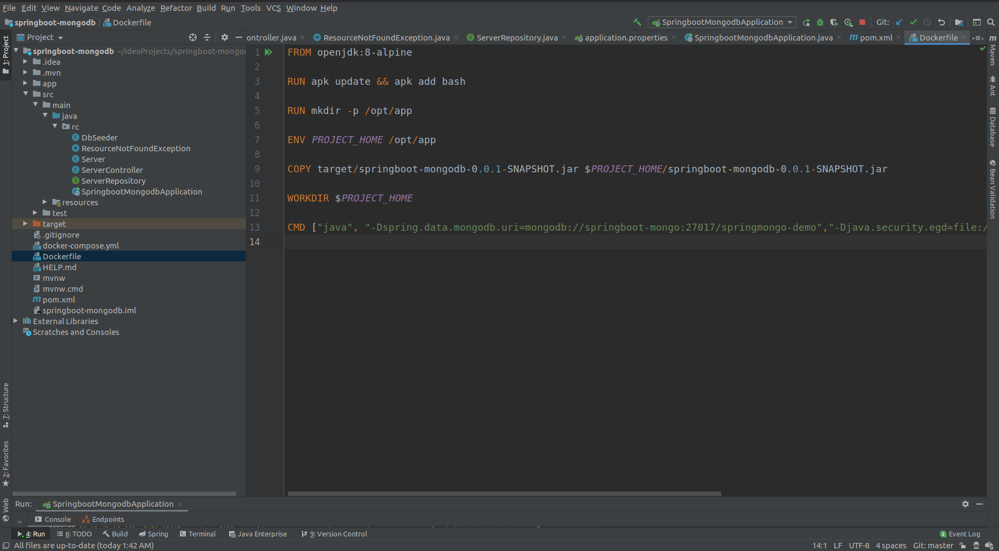
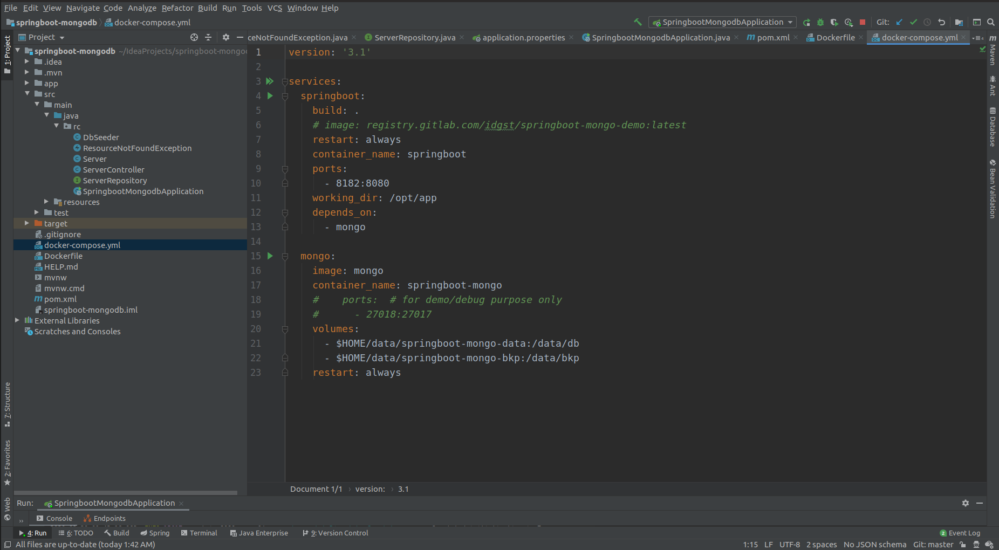
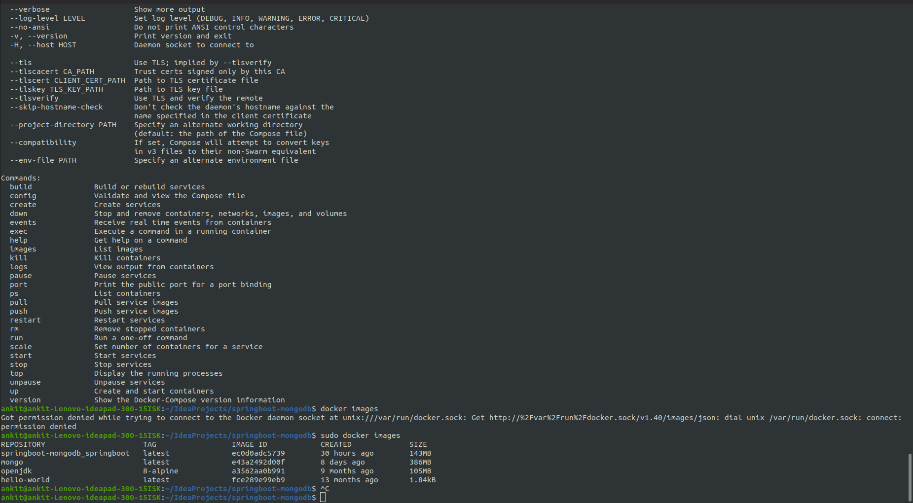
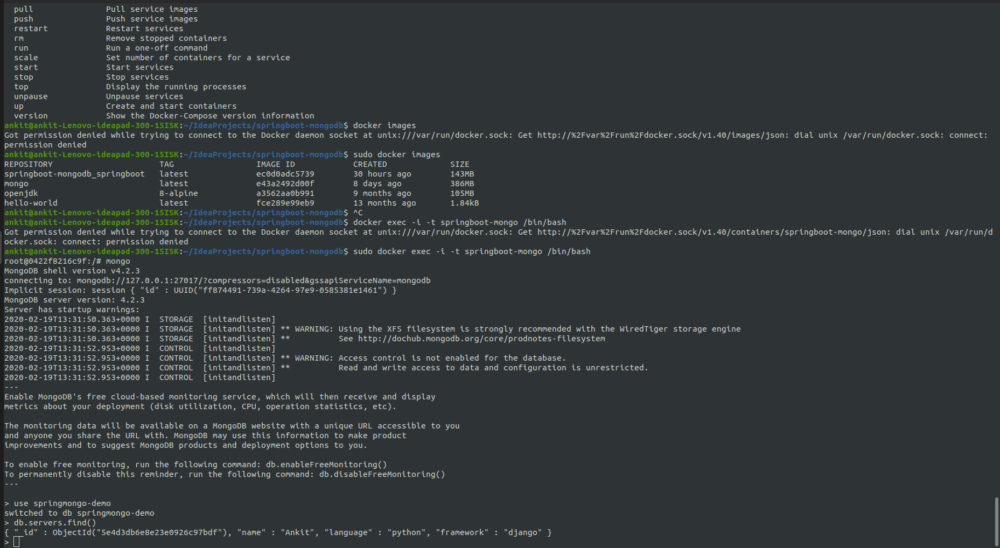

# Task 3: Kubernetes

This repository provides instructions and resources for deploying a Java REST API application, created in Task 1, to a Kubernetes cluster while using MongoDB for data storage. It also includes screenshots to demonstrate the completed task.

## Create a docker file in the root folder of your project





Add the below code to the Dockerfile created.


```
FROM openjdk:8-alpine

RUN apk update && apk add bash

RUN mkdir -p /opt/app

ENV PROJECT_HOME /opt/app

COPY target/springboot-mongodb-0.0.1-SNAPSHOT.jar $PROJECT_HOME/springboot-mongodb-0.0.1-SNAPSHOT.jar

WORKDIR $PROJECT_HOME

CMD ["java", "-Dspring.data.mongodb.uri=mongodb://springboot-mongo:27017/springmongo-demo","-Djava.security.egd=file:/dev/./urandom","-jar","./springboot-mongodb-0.0.1-SNAPSHOT.jar"]

```


```
Build image for our Java application from openjdk alpine image

Update alpine and install bash

Create /opt/app for our java application

Copy compiled (previously) jar file into the PROJECT_HOME folder 

Mark /opt/app folder as working for CMD

Specify a command which will be run when our container is being started
```


The following uri describes the connection to mongodb and springboot-mongo is the name of our docker container.


## Create docker-compose.yml file and add the follwing code. Below code is just the services we need from docker


```
version: '3.1'

services:
  springboot:
    build: .
    # image: registry.gitlab.com/idgst/springboot-mongo-demo:latest
    restart: always
    container_name: springboot
    ports:
      - 8182:8080
    working_dir: /opt/app
    depends_on:
      - mongo

  mongo:
    image: mongo
    container_name: springboot-mongo
    #    ports:  # for demo/debug purpose only
    #      - 27018:27017
    volumes:
      - $HOME/data/springboot-mongo-data:/data/db
      - $HOME/data/springboot-mongo-bkp:/data/bkp
    restart: always
```





## Running our application on docker


```docker-compose up```


Through this command it will keep on running once you stop it using ctrl+c and want docker to run in the background, use the following command.


```docker-compose up -d```


Our running web application should be available in browser by this URL : ```http://localhost:8182.``` Now we can create some server objects.


## To see the containers active


Hit command : ```sudo docker images```


You will find the following





## Add bash to mongo container


By running this command we will add bash to mongo container.

```docker exec -i -t springboot-mongo /bin/bash``` 

The console/terminal will be changed to something like: ```root@ff55937c3772:/#```. It means we’re inside the docker container.

After this write the following:


```
root@ff55937c3772:/#mongo

root@ff55937c3772:/#use springmongo-db

root@ff55937c3772:/#db.servers.find()
```





Here it is both the containers are running seperately.

